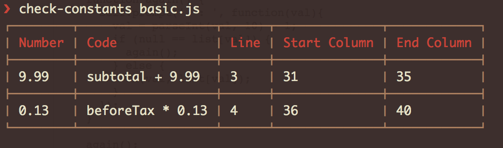

# check-constants
> Find numbers that should be extracted as a declaration statement

[](https://npmjs.org/package/check-constants)
[](https://npmjs.org/package/check-constants)
[](https://travis-ci.org/pgilad/check-constants)

This project is a simplified version of [buddy.js](https://github.com/danielstjules/buddy.js). I found that project
overly complicated for my needs. Also this project parses the code using Esprima
 (actually [Rocambole](https://github.com/millermedeiros/rocambole)) and not UglifyJs.

Given a file `basic.js`:

```js
function getTotal(subtotal) {
    var beforeTax = subtotal + 9.99;
    return beforeTax + (beforeTax * 0.13);
}
```

Running `check-contants basic.js` will find numbers that should be extracted to a declaration statement.

The idea is that numbers that you might reuse are better cached and extracted so that they can be easily
changed and controlled from 1 place.



## Usage

### Command Line

#### Installation

```bash
$ npm install --global check-constants
```

#### Examples

```bash
# Easily check a file by path
$ check-constants file.js

# Check a file by piping it
$ cat file.js | check-constants

# Format output as json
$ check-constants file.js --reporter json

# Override ignored numbers
$ check-constants file.js --ignore 1,5,13

# Disable ignored numbers
$ check-constants file.js --disable-ignore

# Make sure variables are declared as const
$ check-constants --enforce-const file.js

# Check the current version of the cli app
$ check-constants --version

# Show help menu
$ check-constants --help
```

### Programmatic

#### Installation

```bash
$ npm install --save-dev check-constants
```

#### Examples

```js
var fs = require('fs');
var checkConstants = require('check-constants');

var contents = fs.readFileSync('./contents.js', 'utf8');
var errors = checkConstants(contents);
// -> errors will contain possible variables that need extraction
```

### Build Time

Check-Constants can also be used in conjunction with other javascript build systems, such as:

* [gulp-check-constants](https://github.com/pgilad/gulp-check-constants)

## The Output
```js
[{
    "file": "index.js",
    "code": "i = i + 2",
    "value": 2,
    "loc": {
        "start": {
            "line": 5,
            "column": 28
            },
        "end": {
            "line": 5,
            "column": 29
            }
        }
}]
```

## API

### enforceConst

Type: `Boolean`

Default: `false`

Whether to force variable declarations to be defined with `const`

### ignore

Type: `Array`

Default: `[0, 1]`

What numbers should be ignored.

### file

Type: `String`

Default: `null`

Filename being checked if available (i.e not from a stream). Will be attached
to the result object.

## License
Copyright © 2014 Gilad Peleg.
Licensed under the MIT license.
