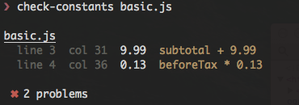

# check-constants
> Find numbers and strings that should be extracted as a declaration statement

[](https://npmjs.org/package/check-constants)
[](https://npmjs.org/package/check-constants)
[](https://travis-ci.org/pgilad/check-constants)

The idea behind this project is that numbers and strings should be extracted as declared constants (or vars), so that they could be easily controlled & changed.
Imagine that you have a function which will calculate the total sum owed after taxes:

```js
//basic.js

function getTotal(subtotal) {
    var beforeTax = subtotal + 9.99;
    return beforeTax + (beforeTax * 0.13);
}
```

As you can see, in a month from now, and in a large code base, we might not remember what are those `9.99` and `0.13`, and
also, suppose we have several instances of the number `0.13` and we want to change it? Now you need to refactor
all occurrences hoping you didn't miss anything or over-do it.

`check-constants` will find the numbers that you should extract as a declaration statement:


The example above, could be re-factored to:

```js
//corrected.js

var FIXED_COST = 9.99;
var TAX = 0.13;

function getTotal(subtotal) {
    var beforeTax = subtotal + FIXED_COST;
    return beforeTax + (beforeTax * TAX);
}
```

Now let's see what happens when we run `check-constants` on the corrected file:


This project uses [Rocambole](https://github.com/millermedeiros/rocambole) to parse your JS,
and it's a simplified version of [buddy.js](https://github.com/danielstjules/buddy.js) which I found overcomplicated and too heavy.

## Usage

### Command Line

#### Installation

```bash
$ npm install --global check-constants
```

#### Examples

```bash
# show the help menu
❯ check-constants --help

  Usage: check-constants [options] <file>

  Options:

    -h, --help                    output usage information
    -V, --version                 output the version number
    -e, --enforce-const           require literals to be defined using const
    -i, --ignore <numbers>        list numbers to ignore (default: 0,1)
    -I, --disable-ignore          disables the ignore list
    -s, --strings                 check strings as well
    -m, --min-length [minLength]  minimum length of strings to be checked [0]
    -r, --reporter [reporter]     specify the reporter to use [table|json] (default: table)

  Examples:

    $ check-constants index.js
    $ check-constants --reporter json index.js
    $ cat index.js | check-constants

# Easily check a file by path
$ check-constants file.js

# Check a file by piping it
$ cat file.js | check-constants

# Format output as json
$ check-constants file.js --reporter json

# Override ignored numbers
$ check-constants file.js --ignore 1,5,13

# Disable default ignored numbers (0,1)
$ check-constants file.js --disable-ignore

# Make sure variables are declared as const
$ check-constants --enforce-const file.js

# Check the current version of the cli app
$ check-constants --version
```

### Programmatic

#### Installation

```bash
$ npm install --save-dev check-constants
```

#### Examples

```js
var fs = require('fs');
var checkConstants = require('check-constants');
var options = {};

var contents = fs.readFileSync('./contents.js', 'utf8');
var errors = checkConstants.inspect(contents, options);
// -> errors will contain possible variables that need extraction
```

### Build Time

`check-constants` can also be used in conjunction with other javascript build systems, such as:

* [gulp-check-constants](https://github.com/pgilad/gulp-check-constants)
* [grunt-check-constants](https://github.com/pgilad/grunt-check-constants)

## The Output
```js
[{
    "file": "index.js",
    "code": "i = i + 2",
    "value": 2,
    "loc": {
        "start": {
            "line": 5,
            "column": 28
            },
        "end": {
            "line": 5,
            "column": 29
            }
        }
}]
```

## API

`check-constants` exposes the following API:

### .inspect(contents, options)

#### contents

`String` - the contents to check

#### options

Options is an optional object containing the following properties:

##### strings

Type: `Boolean`

Default: `false`

Whether to check for strings as well as numbers.

##### minLength

Type: `Number`

Default: `0`

Only used when option `strings` is true. Limits the minimum string length checking.

##### enforceConst

Type: `Boolean`

Default: `false`

Whether to enforce declarations to be used with `const`.

##### ignore

Type: `Array`

Default: `[0, 1]`

Strings and numbers to ignore

##### file

Type: `String`

Default: `null`

Filename being checked if available (i.e not from a stream). Will be attached
to the result object.

### .log[reporter] (results)

#### reporter

Which reporter to use. Currently supported `json` and `table`.

#### results

The resulting object from `.inspect()`

## License

MIT ©[Gilad Peleg](http://giladpeleg.com)
